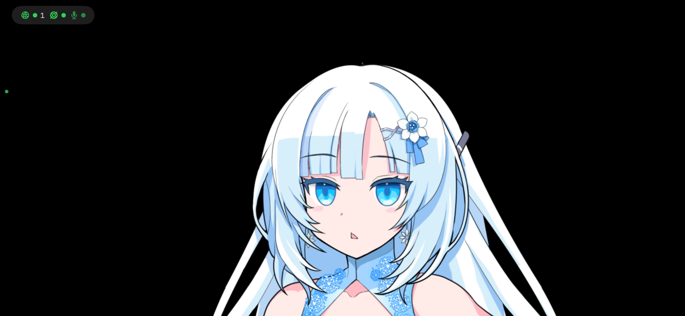
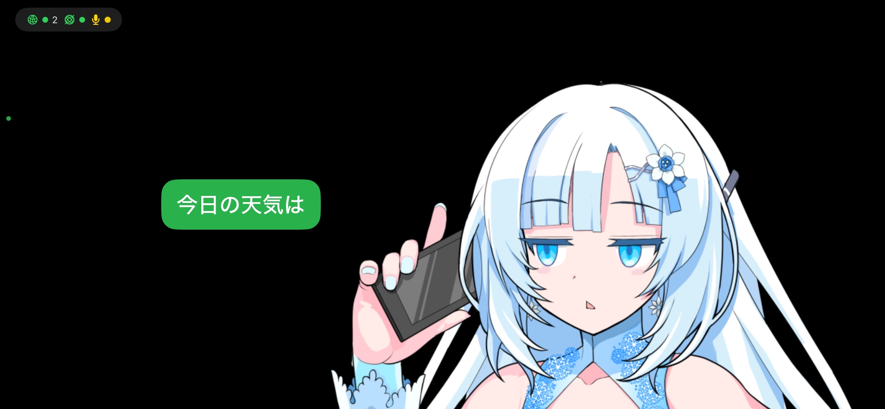
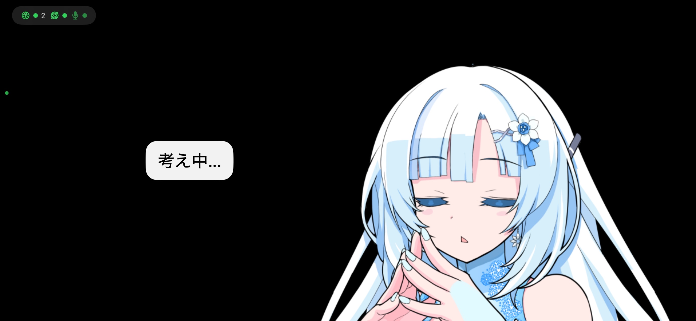
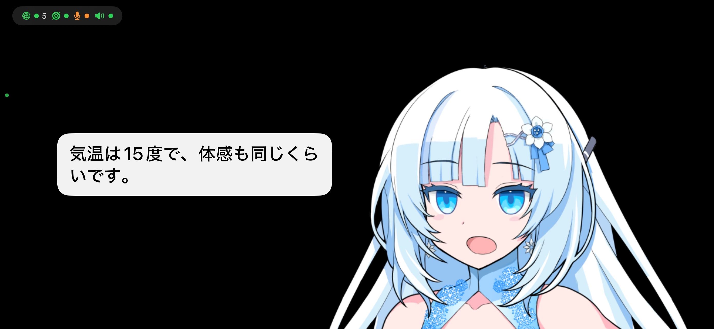

# Yuki Avatar — AI駆動の物理アバターシステム（iPhone用）

[English](README.md) | **日本語**

> **⚠️ これはリファレンス用のスナップショットであり、メンテナンスされるプロジェクトではありません。**
> このリポジトリの目的は、AIアシスタント（Claude、ChatGPT、Codex等）にコードを見せて、同様のシステム構築をスムーズに進めることです。クローンしてそのまま動かすことは想定していません。

## スクリーンショット

| 待機 | 音声入力 | 考え中 | 応答中 |
|------|----------|--------|--------|
|  |  |  |  |

> キャラクター素材: [WhiteCUL立ち絵素材 by moiky](https://seiga.nicovideo.jp/seiga/im11047926) — 本リポジトリには含まれていません。ご自身で画像を用意してください。

## これは何？

iPhoneを [Insta360 Flow Pro](https://www.insta360.com/product/insta360-flow-pro) などのDockKit対応モーター付きスタンドに載せて、**物理的なAIアバター**にするiOSアプリです。

- 🎭 **29種の表情** — 合成済みキャラクター画像をリアルタイムに切り替え
- 🗣️ **音声合成＋リップシンク** — サーバーから送られた音声を再生、口の動きを同期
- 💬 **吹き出し** — アシスタントとユーザーの発話を画面に表示
- 🎤 **音声入力** — 端末上でウェイクワード検出＋音声認識（iOS 26+ SpeechAnalyzer）
- 🤖 **DockKitモーター制御** — うなずき、首振り、見回し、カスタム回転シーケンス
- 🌙 **アイドルシーン** — 居眠り、おやつ、歌、考え中、退屈（焼き付き防止付き）
- 📡 **WebSocket制御** — 全機能をLAN上のJSONコマンドで操作可能

## アーキテクチャ概要

```
┌──────────────┐     WebSocket (8765)     ┌──────────────┐
│  AIバックエンド │ ◄──────────────────────► │  iPhoneアプリ  │
│  (任意のホスト)  │   JSONコマンド + 音声     │  (このコード)   │
└──────────────┘                           └──────┬───────┘
                                                  │ DockKit API
                                           ┌──────▼───────┐
                                           │ モーター付き    │
                                           │ スマホスタンド   │
                                           └──────────────┘
```

このアプリは**表示＋モーター制御**を担当します。AIバックエンドが音声合成（VOICEVOX、ElevenLabs等）を行い、base64エンコードしたWAVを表情・モーションコマンドと一緒にWebSocketで送ります。

## ファイル構成

| ファイル | 役割 |
|---------|------|
| `ContentView.swift` | メインUI — 表情画像の合成、吹き出し、ステータスバー、WebSocketコマンドのルーティング |
| `WebSocketServer.swift` | LAN向けWebSocketサーバー（ポート8765）、Network.framework使用 |
| `ExpressionManager.swift` | 表情enum（29種）、自動まばたき、JSONコマンドパーサー |
| `DockKitManager.swift` | DockKitアクセサリ制御 — ジェスチャー、向き、角速度、モーションプリセット |
| `AudioPlayerManager.swift` | Base64 WAV再生＋リップシンクタイマー |
| `SpeechQueueManager.swift` | 音声アイテムのFIFOキュー（アイテムごとに表情・モーション指定可） |
| `VoiceInputManager.swift` | iOS 26 SpeechAnalyzer — ウェイクワード→発話キャプチャ→バックエンド送信 |
| `IdleSceneManager.swift` | 時間・アクティビティベースのアイドルアニメーション＋画面減光 |
| `SpeechBubbleView.swift` | スタイル付き吹き出し（アシスタント/ユーザー/前回/送信中） |
| `StatusBarView.swift` | 接続状態インジケーター（WebSocket、DockKit、マイク、音声） |
| `CameraManager.swift` | AVCaptureSessionによるカメラプレビュー（DockKitがカメラを必要とする） |

詳細は [`spec/`](spec/) を参照：
- [`architecture.md`](spec/architecture.md) — システム構成図とデータフロー
- [`websocket-protocol.md`](spec/websocket-protocol.md) — WebSocket APIリファレンス
- [`host-scripts.md`](spec/host-scripts.md) — バックエンド制御スクリプト
- [`voice-input.md`](spec/voice-input.md) — 端末上音声入力（iOS 26+）
- [`dockkit-integration.md`](spec/dockkit-integration.md) — モータースタンド制御
- [`idle-scenes.md`](spec/idle-scenes.md) — アイドルアニメーション

## ホストスクリプト（バックエンド制御）

`host-scripts/` にアプリを制御するバックエンドツールが入っています：

| スクリプト | 用途 |
|-----------|------|
| `yuki_cmd.sh` | メインコマンド — 音声合成（VOICEVOX）＋表情＋モーションをWebSocketで一括送信 |
| `ws_send.py` | 汎用WebSocketクライアント（任意のJSONコマンド送信） |

```bash
# クイックスタート
export YUKI_IPHONE_IP=192.168.0.28  # iPhoneのIPアドレス
./host-scripts/yuki_cmd.sh "こんにちは" --expression happy --motion smallNod
```

詳細は [`spec/host-scripts.md`](spec/host-scripts.md) を参照。

## 含まれないもの

- **キャラクター画像** — 本プロジェクトでは [WhiteCUL](https://www.whitecul.com/) を使用していますが著作権上含めていません。`ExpressionManager.swift` の `Expression` enumに合わせたPNG画像をご自身で用意してください。
- **音声合成バックエンド** — アプリは送られてきた音声を再生するだけです。VOICEVOX等の音声合成パイプラインは別途必要です。
- **AIオーケストレーション** — WebSocketプロトコルは `spec/websocket-protocol.md` に記載。バックエンドはご自身で構築してください。

## このリポジトリの使い方

1. **AIアシスタントにこのコードを見せて**、作りたいものを説明する
2. AIがコード＋specから構造を理解し、あなたのシステムに合わせた実装を支援
3. 表情画像を自分のキャラクターに差し替え
4. WebSocketプロトコルを喋るバックエンドを構築
5. 必要に応じてDockKitで物理的な動きを統合

## 要件

- iOS 17.0+（音声入力機能はiOS 26+）
- Xcode 26+
- DockKit対応スタンド（任意、モーター制御用）
- ネットワーク上の音声合成エンジン（VOICEVOX、ElevenLabs等）

## クレジット

- **スクリーンショットのキャラクター素材:** [WhiteCUL立ち絵素材 by moiky](https://seiga.nicovideo.jp/seiga/im11047926) — 元の配布条件に基づき使用。画像ファイル自体は本リポジトリに**含まれていません**。
- **WhiteCUL:** [VOICEVOX](https://voicevox.hiroshiba.jp/) プロジェクトのキャラクター

## ライセンス

MIT — コードは自由に使用できます。キャラクター素材は含まれておらず、別途入手が必要です。
スクリーンショットにはmoiky氏によるWhiteCULキャラクター素材がデモ目的で含まれています。
